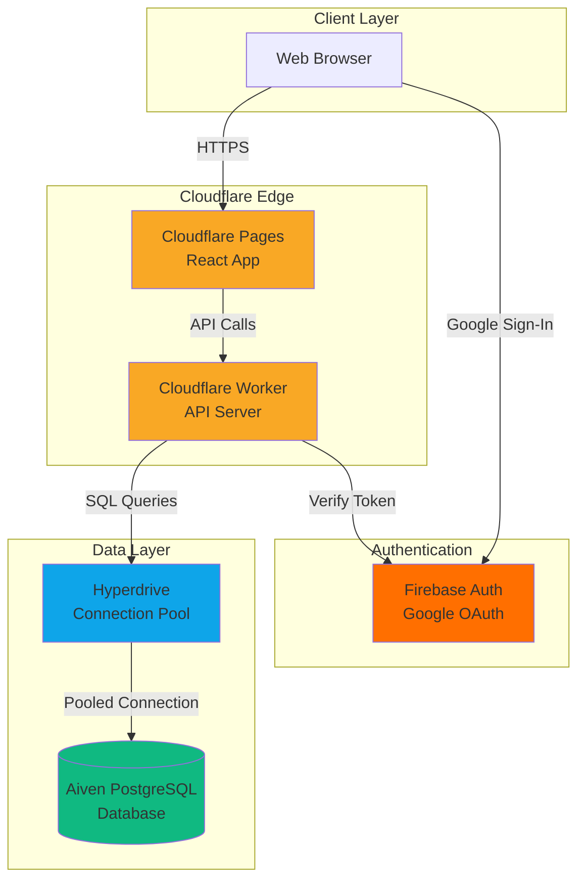
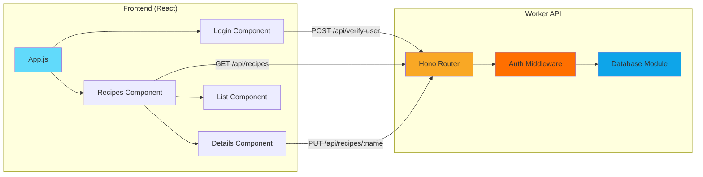
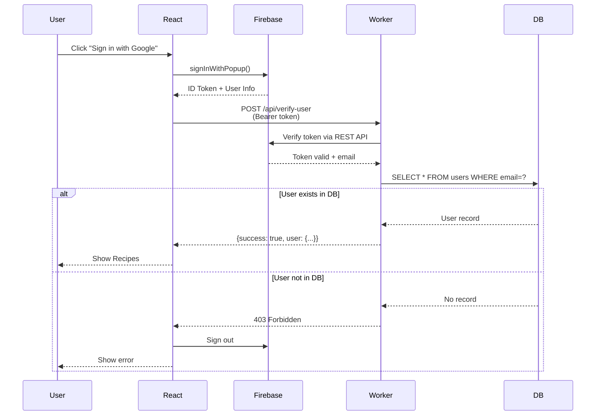
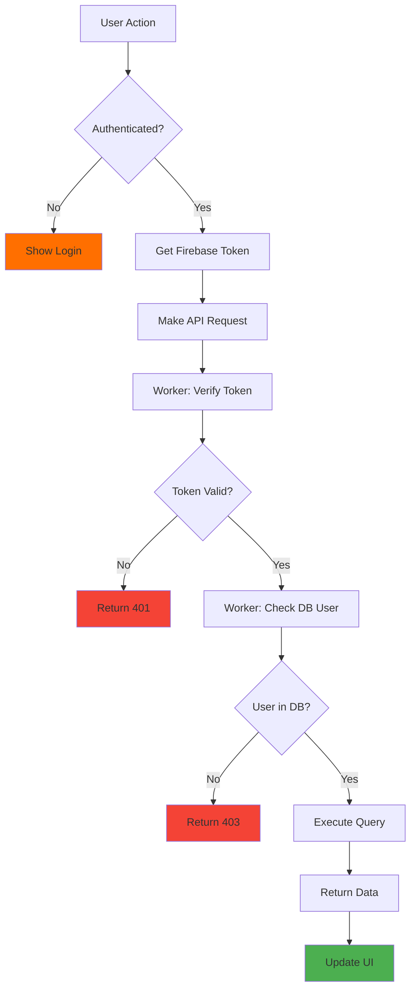
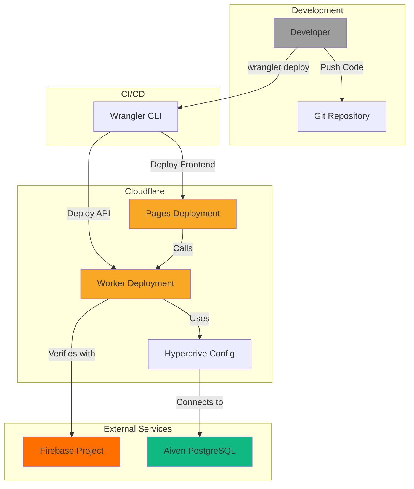

# Architecture Overview

## System Architecture



## Component Architecture



## Authentication Flow



## Data Flow



## Technology Stack Details

### Frontend Stack
| Technology | Purpose | Version |
|------------|---------|---------|
| React | UI Framework | 18.x |
| Firebase SDK | Authentication | 12.6.0 |
| Lucide React | Icons | Latest |

### Backend Stack
| Technology | Purpose | Version |
|------------|---------|---------|
| Cloudflare Workers | Serverless Runtime | - |
| Hono | Web Framework | 4.x |
| postgres.js | PostgreSQL Driver | Latest |
| Hyperdrive | Connection Pooling | - |

### Infrastructure
| Service | Purpose | Provider |
|---------|---------|----------|
| Frontend Hosting | Static site hosting | Cloudflare Pages |
| API Hosting | Serverless functions | Cloudflare Workers |
| Authentication | User auth & OAuth | Firebase |
| Database | PostgreSQL | Aiven |
| Connection Pool | DB optimization | Cloudflare Hyperdrive |

## Database Schema

### Users Table
```sql
CREATE TABLE users (
    email VARCHAR(255) PRIMARY KEY,
    updateable BOOLEAN DEFAULT false
);
```

### Recipe Table
```sql
CREATE TABLE recipe (
    "ID" SERIAL PRIMARY KEY,
    name VARCHAR(255) NOT NULL,
    category VARCHAR(100),
    temperature VARCHAR(50),
    cooktime VARCHAR(50),
    ingredient1 TEXT,
    ingredient2 TEXT,
    -- ... up to ingredient25
    ingredient25 TEXT
);
```

## Security Model

### Authentication Layers

1. **Firebase Token Verification**
   - Validates JWT signature
   - Checks token expiration
   - Extracts user email

2. **Database User Verification**
   - Confirms email exists in `users` table
   - Retrieves user permissions (`updateable`)

3. **CORS Protection**
   - Whitelist of allowed origins
   - Credentials support enabled
   - Preflight request handling

### API Endpoints

| Endpoint | Method | Auth Required | DB Check | Purpose |
|----------|--------|---------------|----------|---------|
| `/health` | GET | ❌ | ❌ | Health check |
| `/api/verify-user` | POST | ✅ | ✅ | Verify user access |
| `/api/recipes` | GET | ✅ | ✅ | List recipes |
| `/api/recipes/:name` | GET | ✅ | ✅ | Get recipe details |
| `/api/recipes/:name` | PUT | ✅ | ✅ | Update recipe |

## Deployment Architecture



## Performance Optimizations

### Cloudflare Edge
- **Global CDN**: Frontend served from 300+ locations
- **Edge caching**: Static assets cached at edge
- **HTTP/3**: Modern protocol support

### Hyperdrive
- **Connection pooling**: Reuses database connections
- **Query caching**: Caches frequent queries
- **Regional optimization**: Routes to nearest database

### Frontend
- **Code splitting**: Lazy loading components
- **Production build**: Minified and optimized
- **Asset optimization**: Compressed images and fonts

## Scalability Considerations

- **Serverless Workers**: Auto-scales with traffic
- **Database Connection Pool**: Handles concurrent requests
- **CDN Distribution**: Global availability
- **Stateless Architecture**: Horizontal scaling ready
